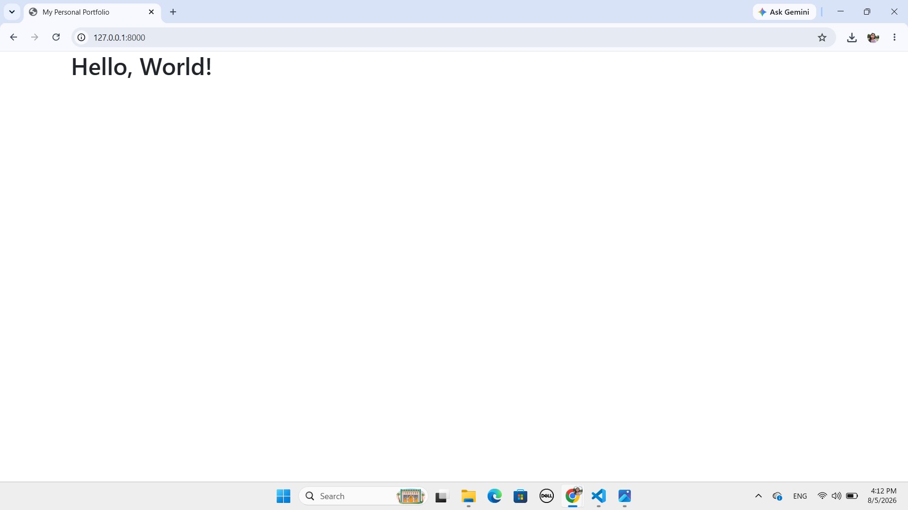
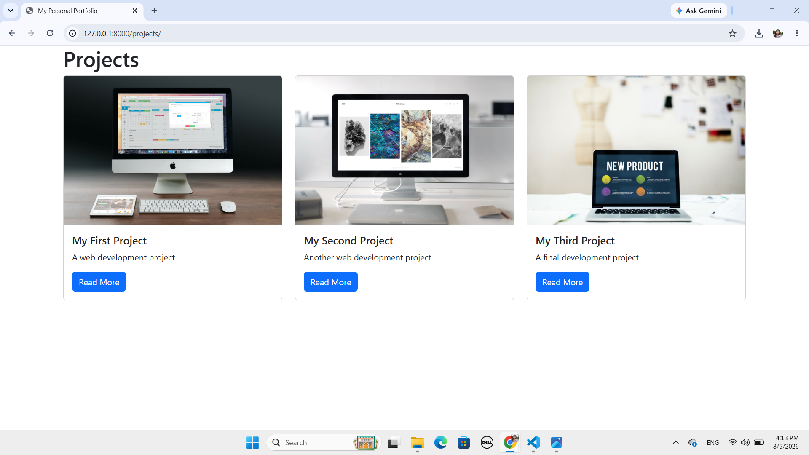
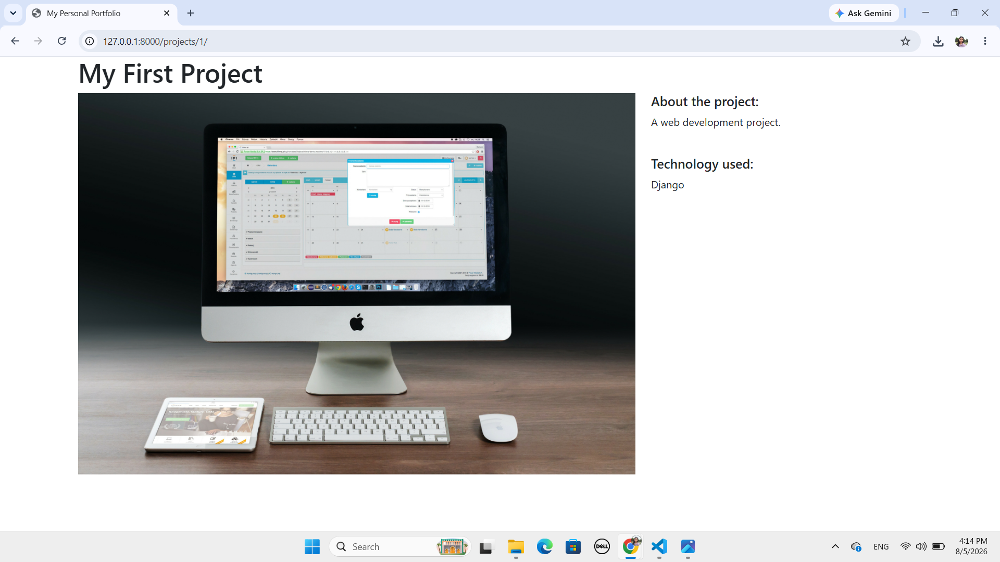
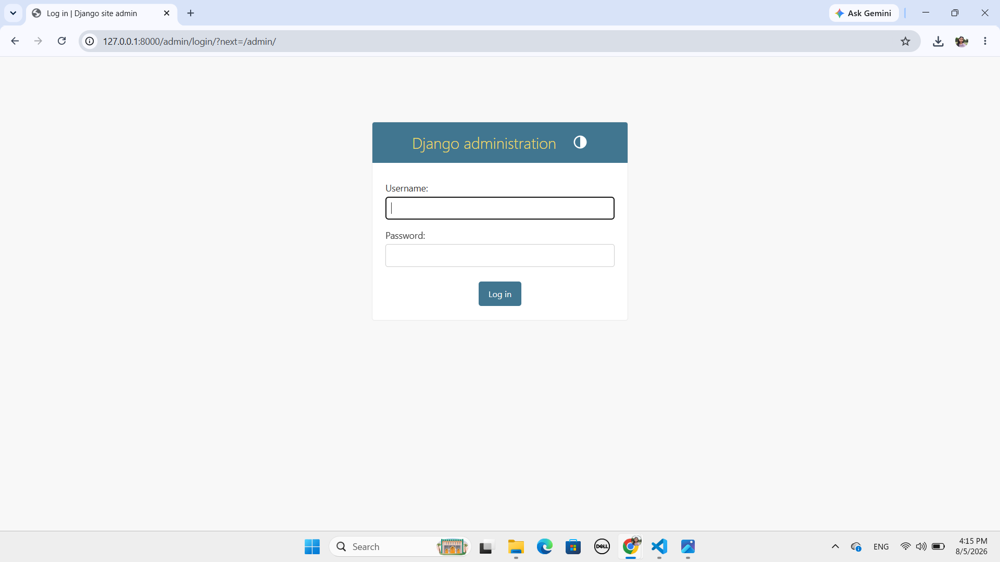

# 🌐 Django Portfolio Website

A simple portfolio website built using Django.

## 📖 About

This project is a portfolio website where users can:

- View all projects
- View project details
- Manage projects through Django Admin
- Upload project images

## ✨ Features

- Home Page
- Projects Page
- Project Detail Page
- Django Admin Panel
- Image Upload Support
- Responsive Design

## 🛠 Technologies Used

- Python
- Django
- HTML
- CSS
- Bootstrap
- SQLite

## 🚀 Installation

Clone the repository

```bash
git clone https://github.com/SrijanaSwarnakar/django_rp-portfolio.git
```

Go to project folder

```bash
cd django_rp-portfolio
```

Create virtual environment

```bash
python -m venv venv
```

Activate virtual environment

```bash
venv\Scripts\activate
```

Install Django

```bash
pip install django
```

Run migrations

```bash
python manage.py migrate
```

Run server

```bash
python manage.py runserver
```

Open:

```
http://127.0.0.1:8000/
```

## 📸 Screenshots

### 🏠 Home Page



### 📂 Projects Page



### 📄 Project Detail Page



### 🔐 Admin Panel



## 📚 What I Learned

- Django Project Structure
- Django Apps
- URL Routing
- Views
- Templates
- Models
- Django Admin
- Database Migrations
- Static Files
- Media Files
- Git & GitHub

## 👩‍💻 Author

**Srijana Swarnakar**

GitHub: https://github.com/SrijanaSwarnakar

## 📄 License

This project is created for learning purposes.